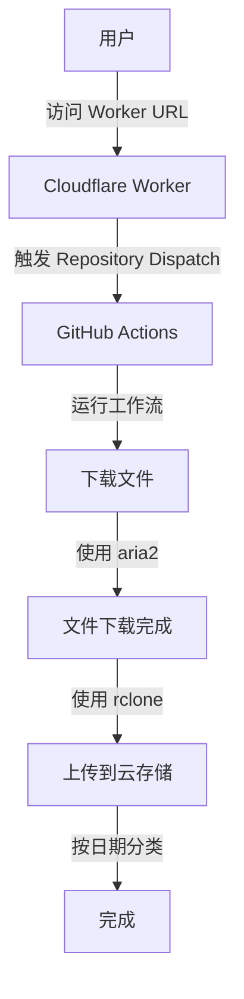

# 🚀 CloudRelay | 远程下载助手


## 📑 目录

- [项目简介](#-项目简介)
- [主要功能](#-主要功能)
- [技术架构](#-技术架构)
- [部署步骤](#-部署步骤)
  - [配置 GitHub 仓库](#1-配置-github-仓库)
  - [部署 Cloudflare Worker](#2-部署-cloudflare-worker)
- [使用方法](#-使用方法)
  - [API 调用](#api-调用)
  - [响应格式](#响应格式)
  - [使用示例](#使用示例)
- [核心代码说明](#-核心代码说明)
- [性能优化](#-性能优化)
- [注意事项](#️-注意事项)
- [错误处理](#️-错误处理)
- [常见问题](#-常见问题)
- [贡献指南](#-贡献指南)
- [许可证](#-许可证)

## 📋 项目简介

CloudRelay 是一个强大的远程文件中转服务，基于 GitHub Actions 构建。它能够自动下载指定链接的文件，并将其安全地上传至您配置的云存储服务。通过 Cloudflare Workers 作为轻量级 API 入口，结合 GitHub Repository Dispatch 事件触发工作流程，实现了完全自动化的文件中转功能。

无论是大文件下载、资源备份还是跨平台文件传输，CloudRelay 都能高效完成任务，同时保持极低的维护成本。

## ✨ 主要功能

- ⚡ 支持任意远程 URL 文件下载
- 🔄 自动上传至多种云存储服务（OneDrive、Google Drive、Dropbox 等）
- 📂 智能按日期分类存储，便于管理
- ⏸️ 支持断点续传，应对不稳定网络
- 🚄 多线程下载加速，最大化带宽利用
- 🔁 智能重试机制，确保传输可靠性
- 🔒 安全可靠，无需维护服务器

## 🔧 技术架构

- **前端 API**: Cloudflare Workers (无服务器函数)
- **工作流引擎**: GitHub Actions (自动化工作流)
- **下载工具**: aria2 (高性能下载工具)
- **云存储工具**: rclone (多云存储管理工具)

## 🔌 部署步骤

### 1. 配置 GitHub 仓库

1. Fork 本仓库到您的 GitHub 账户
2. 进入仓库设置 → Secrets and variables → Actions
3. 添加以下 Repository secrets:
   - `GITHUB_TOKEN`: GitHub Personal Access Token (需要有 `repo` 权限)
   - `RCLONE_CONFIG`: rclone 配置文件内容 (包含您的云存储配置)
   - `REMOTE_NAME`: 远程存储名称 (例如: `onedrive`, `gdrive`)
   - `UPLOAD_PATH`: 上传路径 (例如: `/backup/downloads`)

> **提示**: 如何获取 rclone 配置? 在本地安装 rclone 并配置好云存储后，查看 `~/.config/rclone/rclone.conf` 文件内容。

### 2. 部署 Cloudflare Worker

1. 登录 [Cloudflare Dashboard](https://dash.cloudflare.com/)
2. 进入 Workers & Pages → 创建应用程序 → 创建 Worker
3. 将本仓库中的 `_worker.js` 文件内容复制到 Worker 编辑器中
4. 点击 "保存并部署"
5. 在 Worker 设置中添加以下环境变量:
   - `GITHUB_TOKEN`: 与上面相同的 GitHub Token
   - `GITHUB_OWNER`: 您的 GitHub 用户名
   - `GITHUB_REPO`: 您 fork 的仓库名称 (通常是 `CloudRelay`)

> **安全提示**: 确保将所有敏感信息都存储在 Secrets 中，不要直接硬编码在代码中。

## 📝 使用方法

### API 调用

通过向您部署的 Cloudflare Worker 发送 GET 请求，传入需要下载的 URL：

```http
GET https://your-worker.workers.dev/[encoded-download-url]
```

例如，要下载 `https://example.com/large-file.zip`，您可以使用：

```
https://your-worker.workers.dev/https%3A%2F%2Fexample.com%2Flarge-file.zip
```

> **提示**: URL 需要进行 URL 编码，可以使用在线工具如 [urlencoder.org](https://www.urlencoder.org/) 进行编码。

### 响应格式

**成功响应**:
```json
{
    "success": true,
    "message": "工作流已触发",
    "url": "下载链接"
}
```

**错误响应**:
```json
{
    "success": false,
    "message": "错误信息",
    "error": "详细错误描述"
}
```

### 使用示例

1. **浏览器直接访问**:
   直接在浏览器地址栏输入 Worker URL + 编码后的下载链接

2. **使用 curl 命令**:
   ```bash
   curl "https://your-worker.workers.dev/https%3A%2F%2Fexample.com%2Flarge-file.zip"
   ```

3. **使用 JavaScript**:
   ```javascript
   fetch("https://your-worker.workers.dev/https%3A%2F%2Fexample.com%2Flarge-file.zip")
     .then(response => response.json())
     .then(data => console.log(data));
   ```

## 🧩 核心代码说明

### 1. Cloudflare Worker (API 入口)

Worker 负责接收下载请求并触发 GitHub Actions 工作流：

<details>
<summary>👉 查看 Worker 代码 (_worker.js)</summary>

```javascript
export default {
    async fetch(request, env) {
        const url = new URL(request.url);
        const downloadUrl = decodeURIComponent(url.pathname.substring(1));

        if (!downloadUrl) {
            return new Response(JSON.stringify({ message: '缺少下载链接' }), {
                status: 400,
                headers: {
                    'Content-Type': 'application/json',
                    'Access-Control-Allow-Origin': '*'
                }
            });
        }

        try {
            const githubToken = env.GITHUB_TOKEN;
            const owner = env.GITHUB_OWNER;
            const repo = env.GITHUB_REPO;

            if (!githubToken || !owner || !repo) {
                throw new Error('缺少必要的环境变量配置');
            }

            // 使用验证过的 repository dispatch API 调用方式
            const response = await fetch(
                `https://api.github.com/repos/${owner}/${repo}/dispatches`,
                {
                    method: 'POST',
                    headers: {
                        'Authorization': `token ${githubToken}`,
                        'User-Agent': 'Mozilla/5.0 (compatible; DownloadBot/1.0)',
                        'Content-Type': 'application/json',
                    },
                    body: JSON.stringify({
                        event_type: 'download_file',
                        client_payload: {
                            download_url: downloadUrl,
                            timestamp: new Date().toISOString()
                        }
                    })
                }
            );

            if (response.ok || response.status === 204) {
                return new Response(JSON.stringify({
                    success: true,
                    message: '工作流已触发',
                    url: downloadUrl
                }), {
                    headers: {
                        'Content-Type': 'application/json',
                        'Access-Control-Allow-Origin': '*'
                    }
                });
            } else {
                throw new Error(`无法触发 GitHub Action: ${response.status} ${response.statusText}`);
            }

        } catch (error) {
            console.error('Error:', error);
            return new Response(JSON.stringify({
                success: false,
                message: '服务器错误',
                error: error.message
            }), {
                status: 500,
                headers: {
                    'Content-Type': 'application/json',
                    'Access-Control-Allow-Origin': '*'
                }
            });
        }
    }
}
```
</details>

### 2. GitHub Actions 工作流

工作流负责执行实际的下载和上传操作：

<details>
<summary>👉 查看工作流配置 (.github/workflows/download-upload.yml)</summary>

```yaml
name: Download and Upload to Cloud Storage

on:
  workflow_dispatch:
    inputs:
      download_url:
        description: '下载链接'
        required: true
  repository_dispatch:
    types: [download_file]

jobs:
  transfer:
    runs-on: ubuntu-latest
    steps:
      - name: 获取下载链接
        run: |
          if [ "${{ github.event_name }}" = "repository_dispatch" ]; then
            echo "DOWNLOAD_URL=${{ github.event.client_payload.download_url }}" >> $GITHUB_ENV
          else
            echo "DOWNLOAD_URL=${{ github.event.inputs.download_url }}" >> $GITHUB_ENV
          fi

      - name: 安装 aria2 和 rclone
        run: |
          sudo apt-get update
          sudo apt-get install -y aria2
          curl https://rclone.org/install.sh | sudo bash

      - name: 配置 rclone
        run: |
          mkdir -p ~/.config/rclone
          echo '${{ secrets.RCLONE_CONFIG }}' > ~/.config/rclone/rclone.conf

      - name: 下载文件
        run: |
          mkdir -p downloads
          cd downloads

          # 从URL中提取文件名
          FILENAME=$(basename "$DOWNLOAD_URL" | sed 's/\?.*//')
          echo "下载文件名: $FILENAME"

          # 多线程下载配置
          aria2c --allow-overwrite=true --max-tries=5 \
                --max-connection-per-server=16 \
                --split=16 --min-split-size=1M \
                --connect-timeout=10 --timeout=600 \
                --auto-file-renaming=false \
                "$DOWNLOAD_URL"

      - name: 上传到网盘
        run: |
          # 使用实际的远程存储名称，确保路径格式正确
          REMOTE="${{ secrets.REMOTE_NAME }}"
          UPLOAD_PATH="${{ secrets.UPLOAD_PATH }}"

          # 获取当前日期作为子目录
          DATE_DIR=$(date +"%Y-%m-%d")
          UPLOAD_PATH="${UPLOAD_PATH}/${DATE_DIR}"

          echo "准备上传到: $REMOTE:$UPLOAD_PATH"

          # 多线程上传配置
          rclone copy --progress \
                     --transfers 4 \
                     --checkers 8 \
                     --tpslimit 10 \
                     --retries 3 \
                     --low-level-retries 10 \
                     --stats 1s \
                     downloads/ "$REMOTE:$UPLOAD_PATH"
```
</details>

### 3. 工作流程图




## 🚀 性能优化

CloudRelay 采用了多种技术来优化文件传输性能：

- **多线程下载**: 使用 aria2 的多连接功能，将大文件分割成多个块并行下载
- **智能分块**: 根据文件大小自动调整分块大小，优化传输效率
- **多线程上传**: rclone 配置多个并行传输通道，加速云存储上传
- **自动重试**: 网络波动时自动重试，确保传输完整性
- **断点续传**: 支持从断点处继续传输，避免重新开始
- **超时控制**: 合理的超时设置，平衡效率与可靠性

## ⚠️ 注意事项

1. **权限设置**: 确保 GitHub Token 具有 `repo` 和 `workflow` 权限
2. **配置验证**: rclone 配置文件格式必须正确，建议先在本地测试
3. **资源限制**:
   - GitHub Actions 每月有免费额度限制
   - 注意云存储的容量和带宽限制
4. **安全考虑**: 不要在公开仓库中存储敏感信息
5. **超时设置**: 对于大文件，可能需要调整超时参数

## 🛠️ 错误处理

系统实现了全面的错误处理机制，确保稳定可靠：

| 错误类型 | 处理机制 |
|---------|---------|
| 网络中断 | 自动重试连接 |
| 下载失败 | 多次尝试，详细日志 |
| 上传错误 | 重试机制，错误报告 |
| API 限流 | 指数退避算法 |
| 配置错误 | 详细错误提示 |

## ❓ 常见问题

<details>
<summary>如何处理超大文件?</summary>
对于超过 10GB 的文件，建议调整 aria2 参数：增加 `--piece-length` 值并减少并发连接数。
</details>

<details>
<summary>支持哪些云存储服务?</summary>
支持所有 rclone 兼容的存储服务，包括 Google Drive、OneDrive、Dropbox、S3、FTP 等几十种服务。
</details>

<details>
<summary>如何查看下载进度?</summary>
可以在 GitHub Actions 运行页面实时查看下载和上传进度。
</details>

<details>
<summary>遇到 "Rate Limit" 错误怎么办?</summary>
GitHub API 有调用频率限制，建议减少触发频率或使用更高权限的 Token。
</details>

## 👥 贡献指南

我们欢迎各种形式的贡献，包括但不限于：

- 🐛 报告 Bug
- 💡 提出新功能建议
- 📝 改进文档
- 🔍 审查代码
- 🛠️ 提交 Pull Request

在提交代码前，请确保：
1. 代码符合项目规范和风格
2. 添加必要的测试和文档
3. 遵循 [约定式提交](https://www.conventionalcommits.org/zh-hans/v1.0.0/) 规范

## 📄 许可证

[MIT License](LICENSE) © 2023